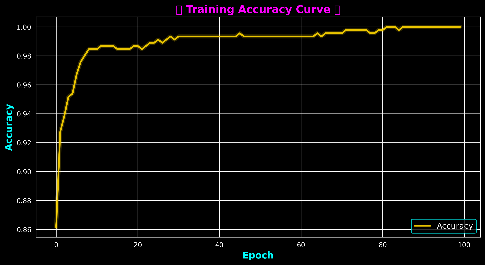
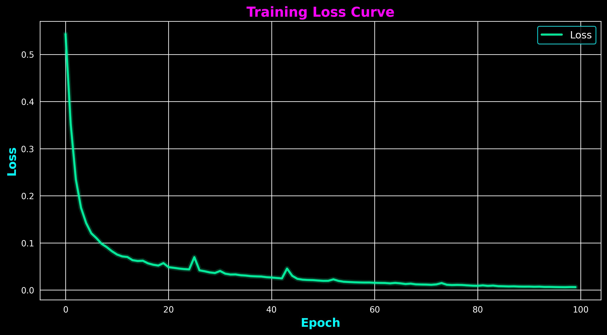

# Breast Cancer Prediction using Neural Networks

This project implements a **binary classification model** using **PyTorch** and **Scikit-Learn** to predict whether a tumor is **malignant** or **benign** based on the **Breast Cancer Wisconsin Dataset**. The model is trained using a simple **feedforward neural network**.

## Project Overview  
- **Dataset**: [Breast Cancer Wisconsin Dataset](https://scikit-learn.org/stable/datasets/toy_dataset.html#breast-cancer-dataset) (from `sklearn.datasets`)  
- **Model**: Feedforward Neural Network  
- **Loss Function**: Binary Cross-Entropy (`nn.BCELoss`)  
- **Optimizer**: Adam Optimizer (`optim.Adam`)  
- **Performance Metrics**: Accuracy  

---

## Results  

### **Training Accuracy Curve**  


### **Training Loss Curve**  


---

## Files in this Repository  

| File                         | Description |
|------------------------------|-------------|
| `Breast_Cancer_Prediction.ipynb` | Jupyter Notebook implementation with full training and evaluation |
| `Breast_Cancer_Prediction.py` | Python script version for execution without Jupyter |
| `training_accuracy_curve.png` | Graph showing accuracy over training epochs |
| `training_loss_curve.png` | Graph showing loss reduction over training epochs |

---

## Installation & Setup  

### **1. Clone the Repository**  
```bash
git clone https://github.com/MoustafaMohamed01/breast-cancer-prediction.git
cd breast-cancer-prediction
```

### **2. Install Dependencies**  
Ensure you have Python **3.7+** installed. Then, install the required libraries:  
```bash
pip install -r requirements.txt
```

Alternatively, install manually:  
```bash
pip install torch torchvision scikit-learn numpy matplotlib seaborn
```

### **3. Run the Model**  
#### **Option 1: Jupyter Notebook**  
Run the notebook inside Jupyter:  
```bash
jupyter notebook
```
Open `Breast_Cancer_Prediction.ipynb` and execute the cells.

#### **Option 2: Python Script**  
Run the script in your terminal:  
```bash
python Breast_Cancer_Prediction.py
```

---

## Model Evaluation  

- The model achieves **high accuracy** on test data.  
- The **loss decreases** over epochs, showing successful learning.  
- Accuracy and loss graphs provide insights into model performance.

---

**Follow me on**: [LinkedIn](https://www.linkedin.com/in/moustafa-mohamed-047736296/) | [GitHub](https://github.com/MoustafaMohamed01) | [Kaggle](https://www.kaggle.com/moustafamohamed01)
